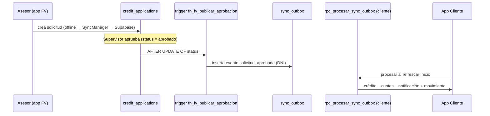

# Arquitectura — App Fuerza de Ventas (Banco Pichincha)

## Capas

```
lib/
├── models/          # Entidades (Client, Application, AsesorNegocio, RouteVisit, BuroReport…)
├── repositories/    # Orquestan datos (Supabase + demo fallback)
│   ├── auth_repository.dart        # Supabase Auth + bloqueo 5 intentos + secure storage
│   ├── application_repository.dart
│   ├── client_repository.dart
│   ├── portfolio_repository.dart
│   ├── route_repository.dart
│   ├── buro_repository.dart
│   └── document_repository.dart
├── providers/       # Estado con Riverpod (StateNotifier)
├── services/        # Acceso técnico
│   ├── supabase_api.dart           # REST (anon key)
│   ├── secure_session_service.dart # flutter_secure_storage (JWT)
│   ├── offline_queue.dart          # cola de envíos pendientes
│   ├── sync_manager.dart           # reintenta envíos al recuperar conexión
│   ├── draft_database.dart         # borradores locales (sqflite)
│   └── document_image_processor.dart
├── screens/         # UI por flujo (cartera, ruta, ficha, buró, solicitud, documentos)
├── widgets/         # Componentes reutilizables
└── utils/           # credit_simulator, format_utils (sin intl)
```

## Base de datos compartida (Supabase)

Misma instancia que la app cliente (`banco_pichincha`), lo que habilita la integración E2E.

| Tabla | Uso |
|-------|-----|
| `asesores_negocio` | Perfil + **rol RBAC** + intentos de login |
| `officers` | Login legacy (demo académico) |
| `clients` | Clientes y datos de negocio |
| `daily_portfolio` | Cartera del día priorizada |
| `credit_applications` | Solicitudes de crédito (originación) |
| `route_visits` | Ruta de visitas con GPS |
| `client_documents` | Expediente digital |
| `buro_queries` / `blacklist` | Consultas de buró y lista negra |
| `sync_outbox` / `sync_log` | **Puente E2E** hacia la app cliente |

## Flujo de integración E2E



## Seguridad (Criterio 4)

- **JWT**: Supabase Auth emite access/refresh token al iniciar sesión.
- **Almacenamiento seguro**: `flutter_secure_storage` (Keystore/Keychain) guarda los tokens y el rol; ya no se exponen en `SharedPreferences`.
- **RBAC**: `asesores_negocio.rol` ∈ {asesor, supervisor, admin}. `fn_rol_actual()` resuelve el rol del JWT para las políticas RLS.
- **Bloqueo de intentos**: `rpc_fv_registrar_intento` incrementa `login_attempts`; al 5.º fallo fija `locked_until = now() + 15 min`. `rpc_fv_login_estado` se consulta antes de autenticar.

## Offline-first (Criterio 2)

- Borradores de solicitud en SQLite (`draft_database.dart`).
- Envíos fallidos van a `offline_queue`; `SyncManager.syncAll()` los reintenta (sube documentos a Storage y crea la solicitud) al recuperar conexión (`connectivity_plus`).
